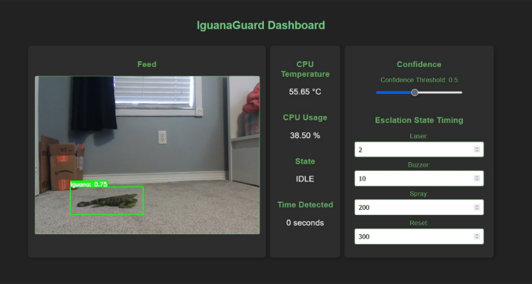
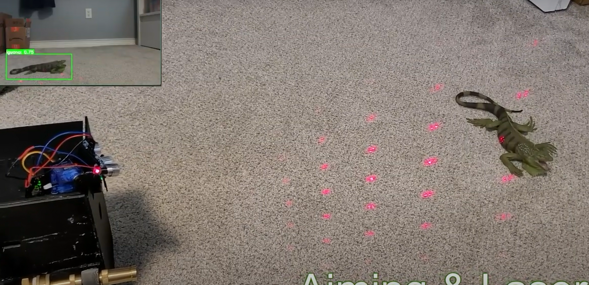
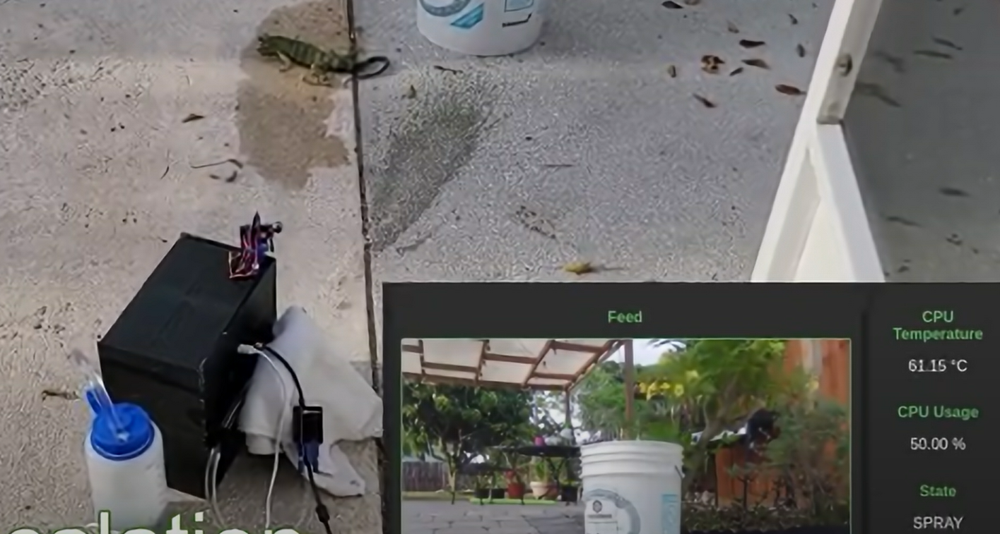

# IguanaGuard
**IguanaGuard** is an automated, humane iguana deterrence system that uses computer vision and an escalation-based response to detect and deter invasive iguanas from protected areas.

## The Problem
Invasive iguanas cause significant damage to infrastructure, landscaping, and native ecosystems in regions like South Florida. Traditional management methods are often labor-intensive, inconsistent, or potentially harmful to other wildlife.

## 💡 Our Solution
IguanaGuard offers a non-lethal, automated approach by combining:
- **AI-powered detection**: Custom-trained computer vision model identifies iguanas in real-time
- **Precision targeting**: Pan-and-tilt mechanism directs deterrents exactly where needed
- **Escalating deterrence**: System applies increasingly effective deterrents only when necessary:
  1. Laser light patterns
  2. Ultrasonic sound
  3. Garlic-based water spray

## Features
- **Humane**: No harm to iguanas or other wildlife
- **Autonomous**: Works with minimal human intervention and maintenance
- **Smart**: Only activates when iguanas are detected with minimal false detections
- **Effective**: Graduated response increases success rate
- **Remote UI**: Real time feed of system Stats include usage, deterrent state, as well as control for variables such as detection confidence interval.

## 🎯 Results
Our testing shows the system effectively deters iguanas while minimizing false positives. The multi-stage deterrence approach proved more successful than any single method alone.

  
  
  

## 📊 Learn More
- **[Project Report](https://github.com/akukerang/IguanaGuard/blob/main/docs/IguanaGuard_Project_Report.pdf)**: Detailed technical specifications, testing methodology, and complete results
- **[FAU Senior Design Showcase](https://www.fau.edu/engineering/senior-design/projects/spring2025/iguana-guard/)**: Official university project page
- **[Demo Video](https://www.youtube.com/watch?v=v8A0wEpKqK8)**
